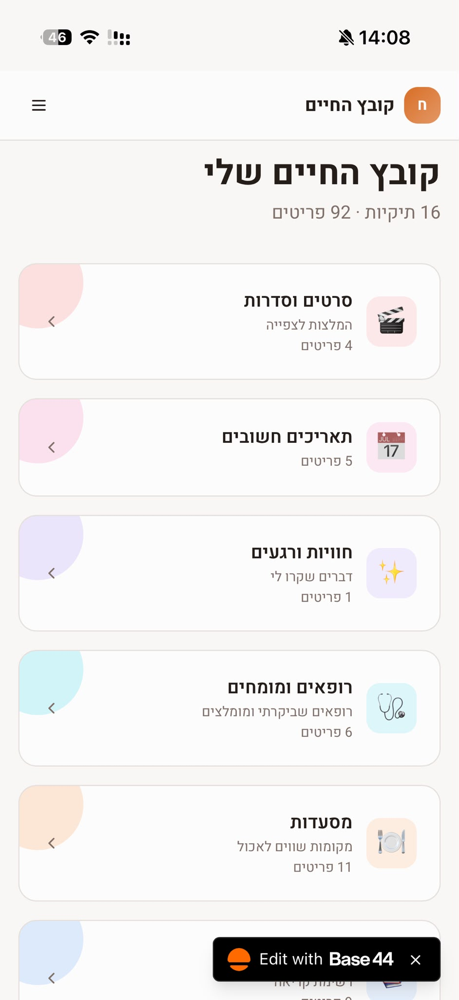
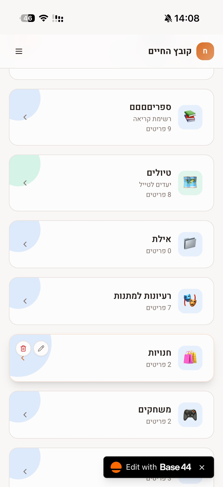
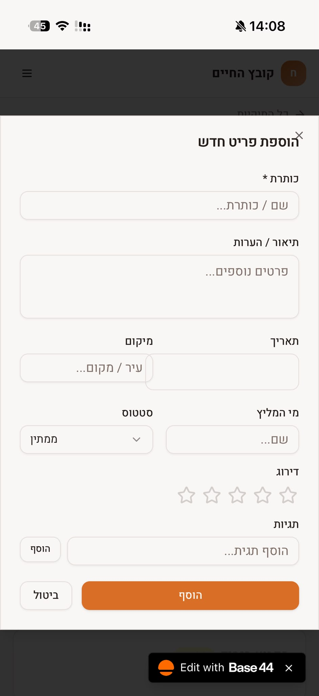
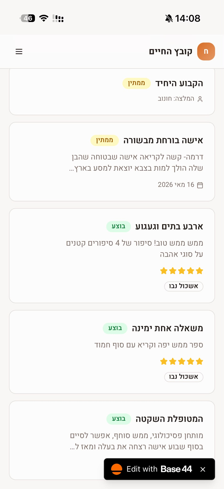

# Life File (קובץ החיים) – Personal Life-Organizer App

A mobile-first web app that collects all of life's "small data" in one place: recommendations, experiences, important dates, places and people. It replaces scattered notes in WhatsApp chats, Facebook posts and phone notes.

Built with **[Base44](https://base44.com)** (AI-powered no-code platform). Used day to day by me and by close friends and family.

> 🔗 **Live app:** [fine-my-life-chronicles.base44.app](https://fine-my-life-chronicles.base44.app/) (Hebrew, best viewed on mobile)

---

## The Problem

Over the years I collected a lot of useful information: a restaurant a friend recommended, a book I wanted to read, a doctor someone praised, gift ideas, places to travel. All of it was spread across WhatsApp, Facebook, notes apps and memory. When I needed something, I couldn't find it.

## The Solution

One organized "file" for everything. Users create their own **categories (folders)** and add **items** to each one. Every item uses the same structure, so it's easy to search, rate and follow up on.

---

## Screenshots

| Home – all categories | More categories | Add a new item | Items in a category |
|:---:|:---:|:---:|:---:|
|  |  |  |  |

---

## Key Features

- **Custom categories:** create, edit and delete folders, each with an icon, color, subtitle and live item count. Examples: Movies & Series, Books, Restaurants, Trips, Important Dates, Doctors & Specialists, Gift Ideas, Shops, Games.
- **Structured items:** every entry has the same fields (see the data model below), so different kinds of information stay consistent.
- **Status tracking:** each item is marked **Pending** or **Done**, so the app also works as a to-do / wish list ("books to read", "places to visit").
- **Ratings and reviews:** a 1–5 star rating plus free-text notes. Recommendations and *dis*-recommendations both live here.
- **Source attribution:** a "Recommended by" field records who suggested each item.
- **Tags:** free-form tags (e.g. book club) for cross-category grouping.
- **Overview dashboard:** the home screen shows the total number of folders and items (16 folders · 92 items in my file).
- **Hebrew and RTL:** full right-to-left interface, designed for mobile use.

## Data Model

```
Category                     Item
─────────────                ─────────────────────────
name                         title          (required)
subtitle / description       description / notes
icon                         date
color                        location
                             recommended_by
        1 ──────────< *      status         (Pending / Done)
                             rating         (1–5)
                             tags           (list)
                             category       → Category
```

A simple one-to-many design: the same generic `Item` schema serves every category. Users can add new kinds of information without any change to the structure.

---

## Process

1. **Problem definition:** mapped where my information actually lived and what I usually needed to find again.
2. **Requirements and data modeling:** designed one generic item schema that would fit very different content types (a movie, a doctor, a restaurant).
3. **Building with AI:** described the app, its screens and its data model to Base44's AI builder, then refined the UI and logic step by step.
4. **Real users and iteration:** shared the app with friends and family, and improved it based on how they actually used it.

## What I Learned

- Turning a messy everyday problem into **clear requirements and a structured data model**.
- Designing a **generic, scalable schema** instead of a separate one for each category.
- **Prompt engineering** for AI app builders: describing screens, entities and behavior precisely.
- **User-centered iteration:** building something people actually use day to day.

## Tech

| | |
|---|---|
| Platform | Base44 (AI no-code app builder) |
| Type | Responsive web app (mobile-first) |
| Language / UI | Hebrew, RTL |
| Data | Base44 built-in database (Category and Item entities) |

---

**Rotem Rave** · Industrial Engineering & Management student, Ben-Gurion University · [GitHub](https://github.com/rotemrave181-rgb)
